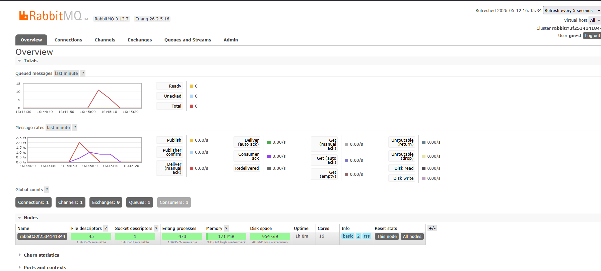

1. What is amqp?

AMQP (Advanced Message Queuing Protocol) is an open-standard protocol for reliable message-oriented middleware communication. 
It is designed to enable interoperability between different systems and programming languages by providing a standardized way for applications to send and receive messages asynchronously. 
AMQP ensures that messages are delivered reliably and in order, making it ideal for distributed systems that require guaranteed message delivery. 
The protocol supports various messaging patterns including point-to-point messaging, publish-subscribe, and request-reply patterns. 
AMQP uses a broker-based architecture where a message broker (such as RabbitMQ) acts as an intermediary, receiving messages from producers and delivering them to consumers. 
One of the key advantages of AMQP is that it provides features like message acknowledgment, message routing, and transaction support, which are essential for building robust and scalable distributed applications.

2. What does it mean? guest:guest@localhost:5672 , what is the first guest, and what
   is the second guest, and what is localhost:5672 is for?

The connection string "guest:guest@localhost:5672" is used to establish a connection to an AMQP message broker, typically RabbitMQ. 
The first "guest" is the username used for authentication, while the second "guest" is the password for that user account. 
Both the username and password are default credentials provided by RabbitMQ installations and are separated by a colon (:). 
The "localhost" part refers to the hostname or IP address of the machine where the AMQP broker is running; in this case, it's the local machine where the client is connecting from. 
The "5672" is the default port number on which the AMQP broker listens for incoming client connections. 
Therefore, the complete connection string specifies that you are connecting to a local AMQP broker using the default user credentials, allowing applications to authenticate and establish a channel for sending and receiving messages through the broker.

RabbitMQ chart when run with slow subscribers:
Explanation:
The spike in this chart happens because the publisher is sending messages faster than the subscriber can process them. When the subscriber is slow, RabbitMQ keeps the incoming messages in the queue instead of delivering them immediately. This causes the total queued message count to rise quickly, sometimes reaching 10 or more messages during a busy period. The chart is showing a temporary backlog, which means messages are waiting to be consumed, not being lost. After the subscriber starts catching up, the queue size begins to drop again. This behavior is normal and shows that RabbitMQ is buffering the messages correctly while the consumer is delayed.

