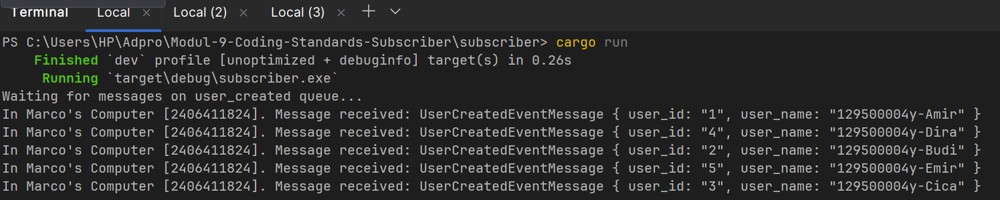
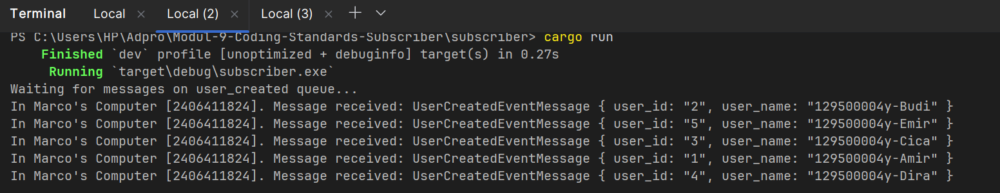
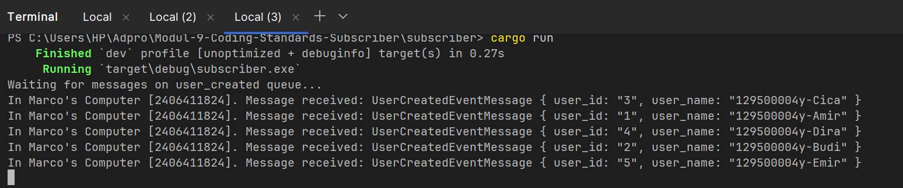

1. What is amqp?

AMQP (Advanced Message Queuing Protocol) is an open-standard protocol for reliable message-oriented middleware communication. 
It is designed to enable interoperability between different systems and programming languages by providing a standardized way for applications to send and receive messages asynchronously. 
AMQP ensures that messages are delivered reliably and in order, making it ideal for distributed systems that require guaranteed message delivery. 
The protocol supports various messaging patterns including point-to-point messaging, publish-subscribe, and request-reply patterns. 
AMQP uses a broker-based architecture where a message broker (such as RabbitMQ) acts as an intermediary, receiving messages from producers and delivering them to consumers. 
One of the key advantages of AMQP is that it provides features like message acknowledgment, message routing, and transaction support, which are essential for building robust and scalable distributed applications.

2. What does it mean? guest:guest@localhost:5672 , what is the first guest, and what
   is the second guest, and what is localhost:5672 is for?

The connection string "guest:guest@localhost:5672" is used to establish a connection to an AMQP message broker, typically RabbitMQ. 
The first "guest" is the username used for authentication, while the second "guest" is the password for that user account. 
Both the username and password are default credentials provided by RabbitMQ installations and are separated by a colon (:). 
The "localhost" part refers to the hostname or IP address of the machine where the AMQP broker is running; in this case, it's the local machine where the client is connecting from. 
The "5672" is the default port number on which the AMQP broker listens for incoming client connections. 
Therefore, the complete connection string specifies that you are connecting to a local AMQP broker using the default user credentials, allowing applications to authenticate and establish a channel for sending and receiving messages through the broker.

RabbitMQ chart when run with slow subscribers:
Explanation:
The spike in this chart happens because the publisher is sending messages faster than the subscriber can process them. When the subscriber is slow, RabbitMQ keeps the incoming messages in the queue instead of delivering them immediately. This causes the total queued message count to rise quickly, sometimes reaching 10 or more messages during a busy period. The chart is showing a temporary backlog, which means messages are waiting to be consumed, not being lost. After the subscriber starts catching up, the queue size begins to drop again. This behavior is normal and shows that RabbitMQ is buffering the messages correctly while the consumer is delayed.

RabbitMQ chart when run with many slow subscribers connected to the same queue: 
Explanation:
The queue stays lower in this case because the three slow subscribers are sharing the same queue instead of each receiving a full copy of every message. RabbitMQ distributes messages among consumers on the same queue, so the messages are load-balanced rather than duplicated. That means once a message is delivered to one subscriber, it is no longer counted as waiting in the queue, even if that subscriber has not finished processing it yet. With three subscribers running at the same time, RabbitMQ can keep about three messages in flight, one for each consumer, which is why the visible queued count drops to around three instead of climbing to 10 or more. The chart is therefore showing only the remaining waiting messages, not the messages already handed out to the subscribers. This behavior is normal and shows that having more consumers reduces the backlog more effectively than having only one slow consumer.

NOTE: Several subscriber terminal Screenshots:

Possible improvements for the current publisher and subscriber code:

1. Use constants or environment variables for the RabbitMQ URI, exchange name, and queue name instead of hardcoding them in the source code.
2. Replace `unwrap()` with proper error handling so the program can fail gracefully and show clearer error messages.
3. Add publisher confirms so the publisher can verify that RabbitMQ has accepted the message before moving on.
4. Set a prefetch limit such as `basic_qos(1)` in the subscriber so slow consumers receive messages more fairly and the queue behavior is easier to control.
5. Keep manual acknowledgements, but only acknowledge a message after it has been successfully processed.
6. Use unique consumer tags or let RabbitMQ generate them automatically when running multiple subscribers.
7. Remove hardcoded log text like `In Marco's Computer [2406411824]` and replace it with a generic or configurable message.
8. Separate message creation, serialization, and publishing into smaller helper functions to make the code easier to read and maintain.
9. Add retry logic or reconnection handling if the RabbitMQ connection is temporarily unavailable.
10. Add basic integration tests to verify that the publisher and subscriber can still communicate correctly after code changes.
